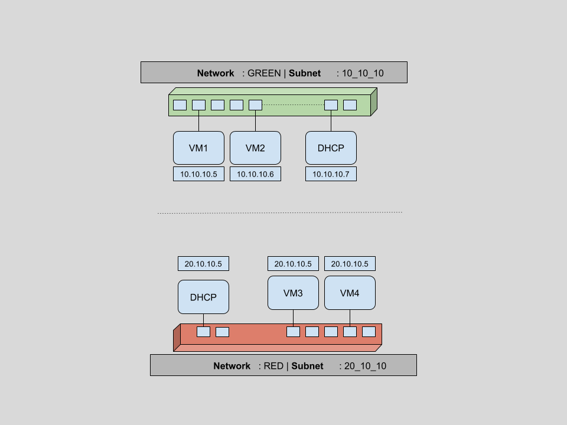
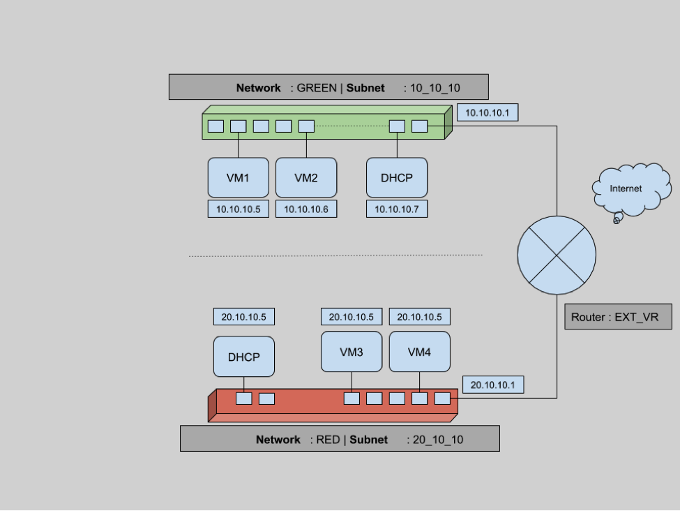

# OpenStack Neutron WorkShop

 
 
 
 
 
 

## Kavit Munshi & Alok Kumar

 
 

### Aptira

 

---

# Agenda

 
 
 
 

* Introduction to OpenStack
* Architecture Overview
* Dashboard Overview
* Add image using Dashboard
* Boot VM using Dashboard

---

# Introduction to OpenStack

---

 
 

**OpenStack is a cloud operating system** that controls pools of **compute, storage, and networking**
resources on public, private or hybrid clouds.

 
 

**The OpenStack mission:** to produce the ubiquitous Open Source Cloud Computing platform that will
meet the needs of public and private clouds regardless of size, by being simple to implement and
massively scalable.

---

Different OpenStack Projects

* Keystone (Identity)
* Nova (Compute)
* Glance (Image)
* Cinder (Block Storage)
* Neutron (Networking)
* Swift (Object Storage)
* Heat (Orchestration)
* Ceilometer (Telemetry)
* Horizon (Dashboard)

---

# OpenStack Dashboard (Horizon)

---

# Horizon Overview

 
 
 
 

* Provides user interface to OpenStack use cases
* Written in django + AngularJS
* Stateless web application which relies on other openstack service APIs.

---
# Try It Yourself

 
 
 
 

* Get familiar with horizon dashboard
* Make sure your devstack setup is working.

---

# OpenStack Authentication & Permission

---

# Keystone Overview

 
 
 
 

* Implements OpenStack identity API
* Provides identity, token, catalog & policy services.

---

# Try It Yourself

 
 
 
 

* Understand openstack authentication process using --debug
* Generate a token and use this to make a curl call

---

# OpenStack Image Registry

---

# Glance Overview

 
 
 
 

* Provides images and metadata definitions
* Images made available through Glance can be stored in variety of locations.
* From simple filesystems to object storage like OpenStack's own swift project.

---

# Try It Yourself

 
 
 
 

* Upload same cirros image on different name.
* Upload under multiple tenants and vrify visibility.

---

# Neutron Networking in OpenStack

---

# OpenStack Neutron

 
 
 

> Neutron is an OpenStack project to provide “network connectivity as a service” between interface
> devices (e.g., vNICs) managed by other OpenStack services (e.g., nova)

---

# OpenStack Neutron

 
 

In very simple terms neutron
 
 

* allows users to create and manage network objects, such as networks, subnets and ports, which other OpenStack services can use through an API.
* It enables a large number of operators to implement complex set of networking technologies to power their network infrastructure, through the use of agents, plugins and drivers.

---

# Workshop Overview

 
 

As part of this workshop:

 

1. We will create two sets of networks and subnets.
2. Then we will spawn multiple VMs across these networks and verify network connectivity for static IPs.
3. Next we will look into restricting access to VMs using security groups.
4. Finally an insight to connectivity across different networks using routers and floating IPs.

---

# 1. Create Networks, Subnets & Verify Ports

---

# Create networks & subnets

 
 

---

# Create networks & subnets

 
 
 
 

    !shell
    neutron net-list
    neutron net-create GREEN
    neutron subnet-create --name 10_10_10 GREEN 10.10.10.0/24
    neutron net-list

---

# Create networks & subnets

 
 

## Verify ports from dashboard

---

# Try It Yourself

 
 
 
 

* Create another network (RED)
* Create another subnet (20_20_20) for this network
* Verify created network, subnet & port from CLI as well as dashboard

---

# 2. Spawn Virtual Machines

---

# Boot Green Virtual Machine

 
 

---

# Boot Green Virtual Machine

 
 
 
 

    !shell
    openstack network list
    # Boot using private network
    nova boot --flavor m1.tiny --image cirros --nic net-id=<NET_ID> greenbox01
    nova list
    neutron port-list

---

## Try It Yourself

 
 
 
 

* Boot another tiny VM in on GREEN network from dashboard.
* Verify that ports created are in GREEN network
* Boot two more tiny VMs from CLI in RED network.

---

# 3. Security Groups

---

 
 
 
 

* Security groups are a virtual firewall for your compute instances to control inbound and outbound traffic.
* Security Groups in OpenStack are implemented per VM.
* You can create a bunch of security group rules and assign them to instances
* implemented through plain Linux Bridges

---

# Allow SSH access to VMs

 
 
 
 

    !shell
    nova secgroup-list
    nova secgroup-list-rules default
    nova show greenbox01 | grep security_groups
    nova secgroup-add-rule default tcp 22 22 0.0.0.0/0
    nova secgroup-list-rules default | grep 22

---

# Try It Yourself

 
 
 
 

* Create another security group osid
* Allow all ICMP pings
* Veriy this by attaching this to any of VMs

---

# 4. Routers

---

# Routers Connect Networks

---

# Routers operate in Layer 3 of OSI layer

 
 
 
 

## Routers are logical networking components which

 

* Forward data packets between networks,
* Provide L3 and NAT forwarding to provide external access for VMs on tenant networks.

---

# Let's Attach RED and GREEN networks through router

 
 
 
 

    !shell
    neutron router-create EXT_VR
    neutron router-interface-add <INTERFACE_ID> 10_10_10
    neutron router-interface-add <INTERFACE_ID> 20_10_10

  * Verify Pings across two machines on different networks

---

# Try It Yourself

 
 
 
 

* Create another new router

---

# Current Status - No outside connectivity

 

* Though there is connectivity between virtual machines across different networks, there is still no outside connectivity.
* Packets flowing from virtual machines still cannot reach to any outside network.

---

# Let's make router our Gateway

To have external connectivity, we need to set this router as a gateway, which means connecting one interface of the router to the external network. In our case we have an existing external network, and we will add this network as a gateway for this router.

    !shell
    neutron router-gateway-set EXT_VR ext
    neutron port-list

---

# 5. Floating IPs

---

# No connectivity from outside to inside

## Problem

 
 

---

# No connectivity from outside to inside

## Solution

 
 

One way to allow connectivity for a VM from outside networks is creating public IPs for each of the VMs. But this is not maintainable in the long term.
Using public IPs per VM will lead us to a situation where we have to maintain a large pool of IPs per VM.

In general we want our VMs to be disconnected from the public network except occasionally.

---

# Introducing Floating IP

 
 

Floating IPs are routable public IPs which can be assigned to a VM and revoked again. This is maintained on the router level.

 
 

    !shell
    neutron floatingip-list
    neutron floatingip-create ext
    neutron floatingip-associate 02ff1d61-6280-4f25-a8ff-9e5676ece01d 378956ec-3928-4e06-873c-423b7f017695
    neutron floatingip-list

---

# Try It Yourself

 
 
 
 

* Attach floating IP to both VMs in RED network and verify ssh access

---

# Summary

 
 

This brings the end of **Workshop on  Neutron networking in OpenStack**.

 
 

Now we have an unserstanding on

* How to create networks and subnets in an OpenStack cloud.
* Blocking/Allowing traffic per virtual machine through the use of security groups.
* How to connect different networks using L3 switching and routers.
* How to use floating IPs to allow external connectivity to virtual machines.

---

# Conclusion
